# 文件服务

## 需求分析

- 增
  - 适配不同的文件存储工具，目前只支持minio。
  - 二进制流上传文件。
  - 分片上传文件。
  - 允许自定义文件名。
    - 允许重名。
    - 允许一个文件有多个文件名。不同文件名对应不同的id，但文件只存一份。
  - 限制上传文件类型、大小等。
- 删
  - 移除文件。
- 查
  - 提供文件临时访问地址。
  - 提供文件信息，包括文件名、文件大小、创建时间等。
  - 下载断点续传。

## 架构设计

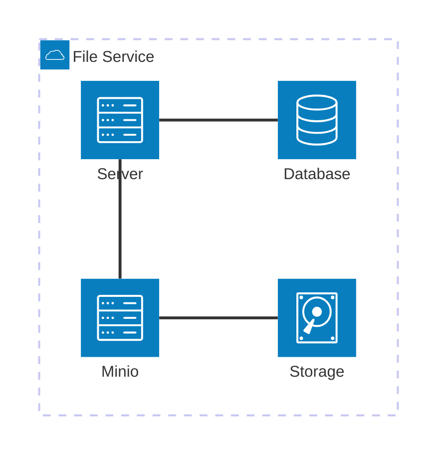

## 接口设计

> 文件hash值使用md5算法计算，因为minio仅支持md5算法。

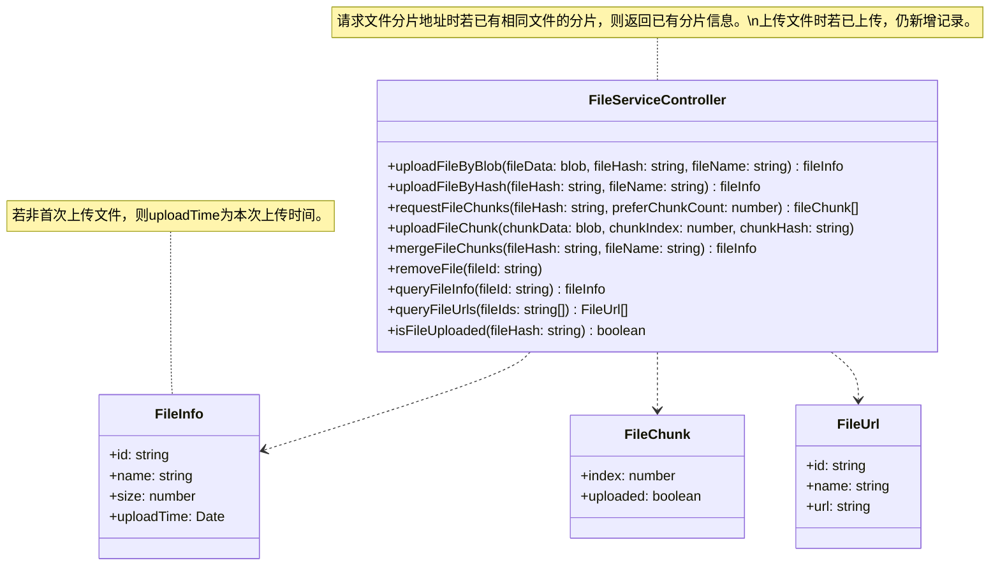

## 库表设计

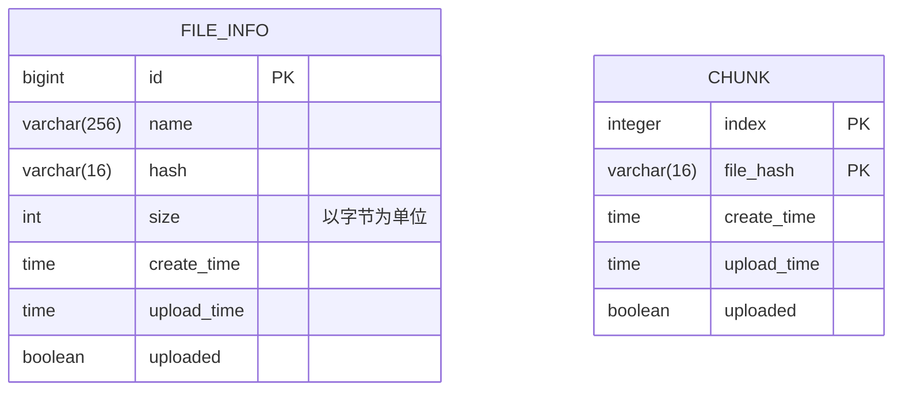

## 流程设计

### 客户端上传文件

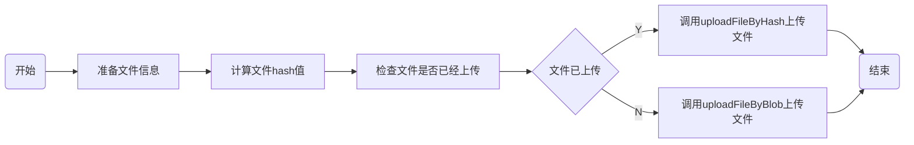

### 客户端分片上传文件

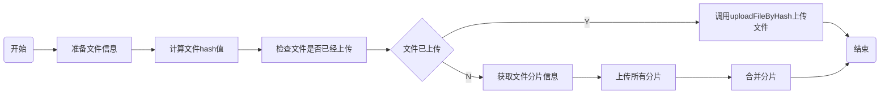

### uploadFileByBlob

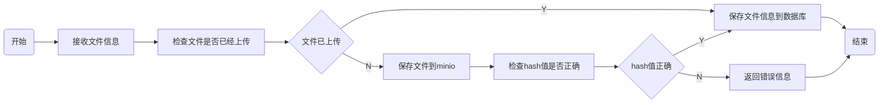

### uploadFileByHash

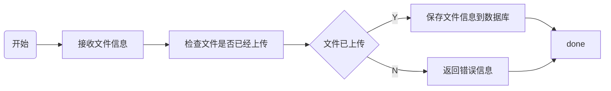

### requestFileChunks

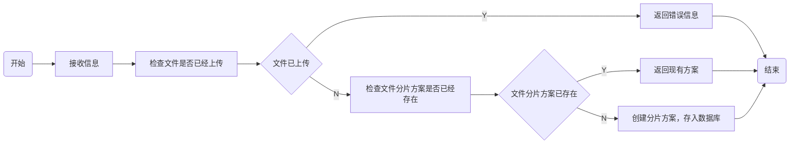

### uploadFileChunk

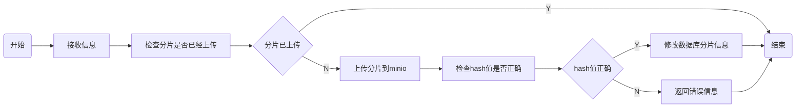

### mergeFileChunks

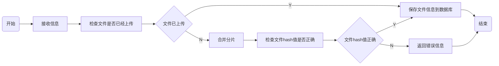

### removeFile

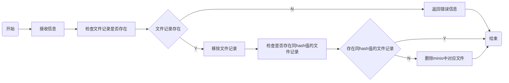
