# 文件服务

## 预期目标

### 内容

- 单机性能（普通游戏本）
  - 对于小文件，IOPS 在几百到几千之间，吞吐量为每秒几 MB 到几十 MB。
  - 对于大文件，最大吞吐量约为 100-125 MB/s，响应时间为毫秒级别。
  - 支持几十个并发用户进行基本的文件操作。
- ⚪支持rpc服务
- ⚪支持高效的二次封装

### 核心

- 稳定
- 可扩展hook
- 支持较高并发
- 避免并发错误
- 避免重复上传

## 需求分析

- 增
  - 适配不同的文件存储服务，目前只需支持minio。
  - 以二进制流的形式上传文件。
  - 分片上传文件。
  - 允许自定义文件名。
    - 允许重名。
    - 允许内容相同的文件有多个文件名。不同文件名对应不同的id，但文件只存一份。
  - 限制上传文件类型、大小等。
- 删
  - 移除文件记录。
  - 在存储服务中移除文件。
- 查
  - 提供文件临时访问地址。
  - 提供文件存储相对路径。
  - 提供文件信息，包括文件名、文件大小和创建时间等。
  - ⚪下载断点续传。

## 架构设计

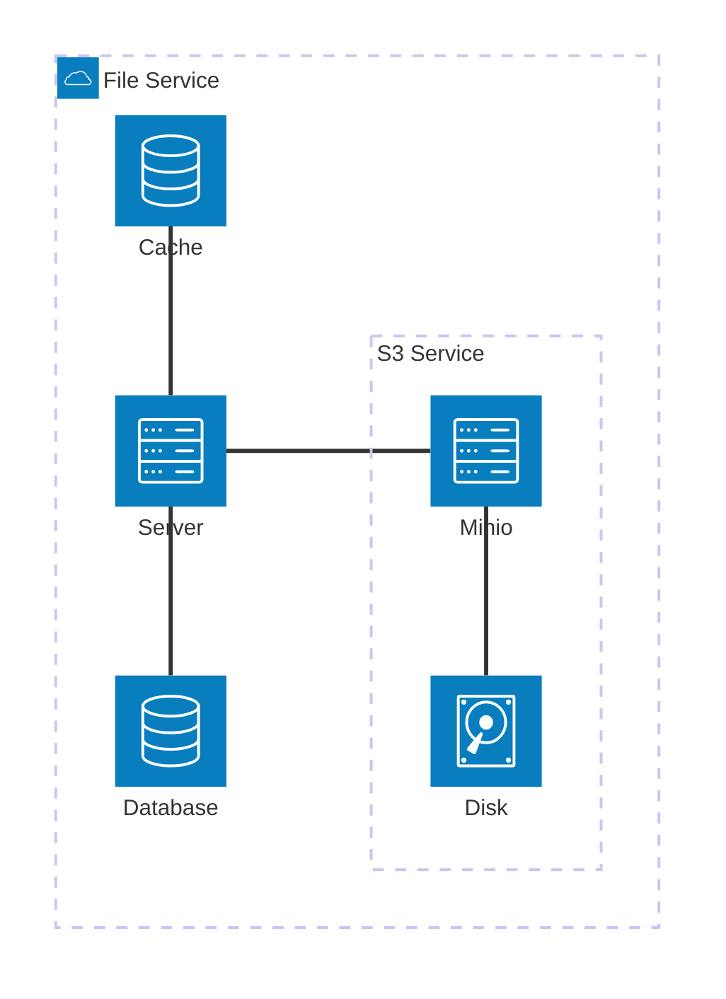

## 接口设计

> 文件hash值使用md5算法计算，因为minio仅支持md5算法。

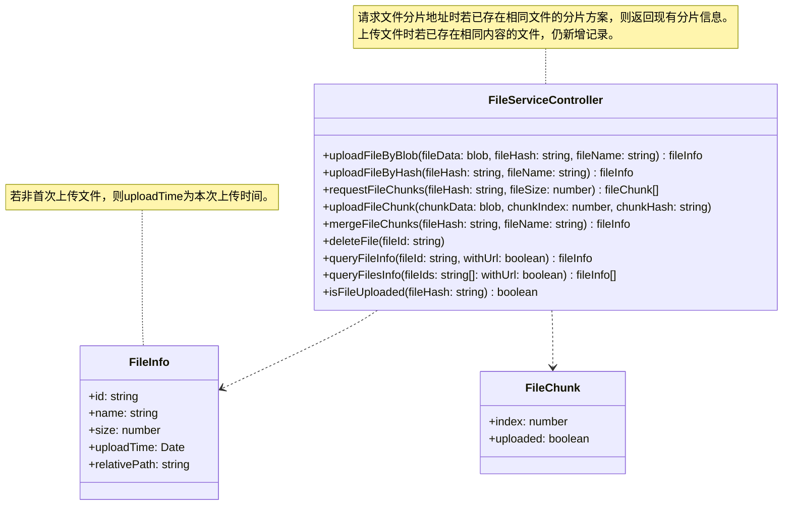

## 库表设计

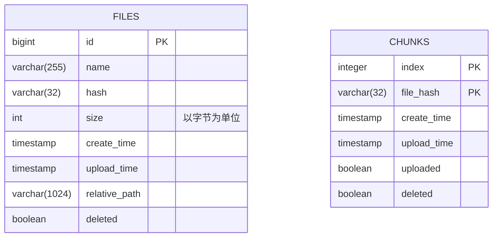

## 流程设计

### 客户端上传文件

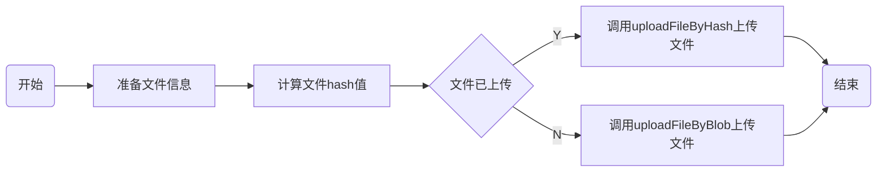

### 客户端分片上传文件

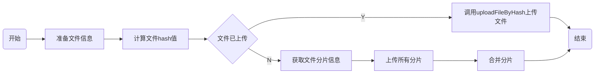

### uploadFileByBlob

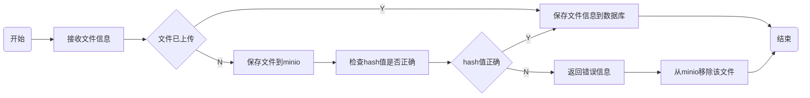

### uploadFileByHash

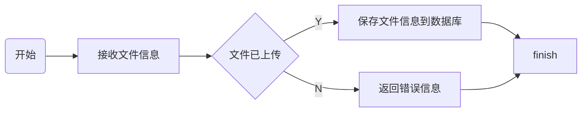

### requestFileChunks

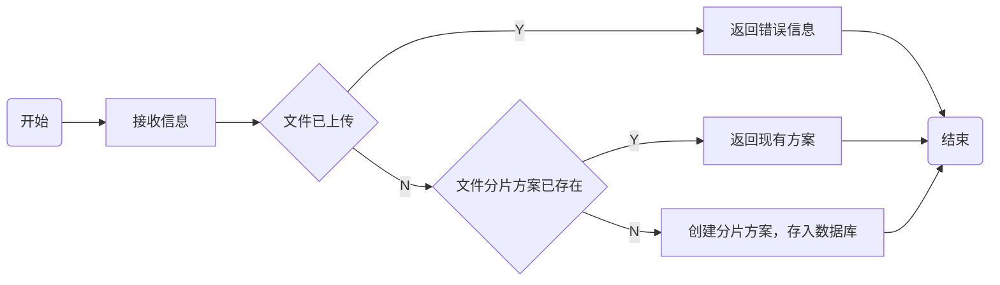

### uploadFileChunk

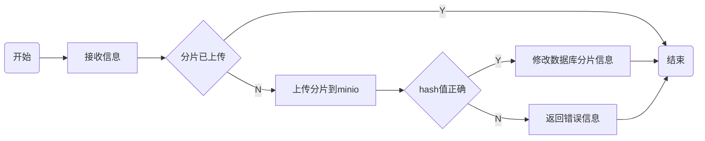

### mergeFileChunks

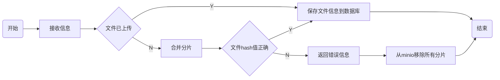

### deleteFile

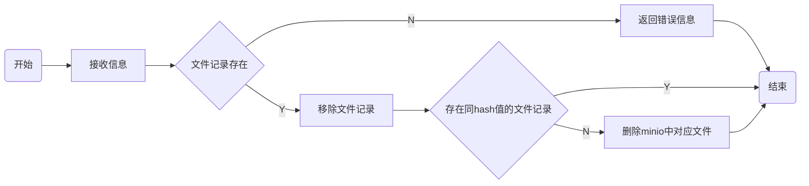
